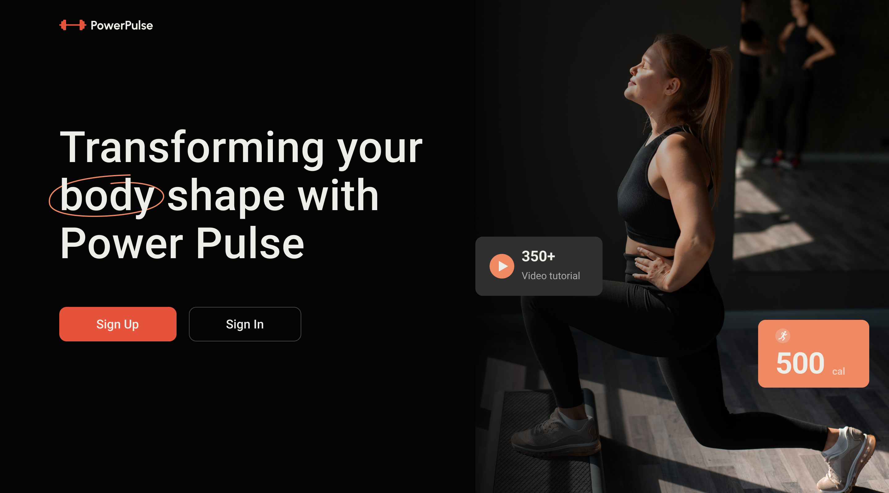

[UK](README-uk.md) | [ES](README-es.md) | [DE](README-de.md) | [FR](README-fr.md)

# PowerPulse 2.0

**Power Pulse** is an innovative app for any device that will support you in achieving your healthy goals and help you maintain a healthy lifestyle. 

With our advanced functionality and user-friendly interface, we make the journey to a healthy and energetic life fun and effective.

## Review

It is designed for active and motivated people who strive for a healthy lifestyle and want to control their eating and exercise habits. The app is ideal for both fitness beginners and experienced trainers, especially for those looking for a convenient tool to track their fitness and nutrition achievements.

## Content

- [PowerPulse 2.0](#powerpulse-20)
  - [Review](#review)
  - [Content](#content)
  - [Technologies](#technologies)
  - [Functionality](#functionality)
  - [Installation](#installation)
  - [Development Team](#development-team)
  - [Useful links](#useful-links)

## Technologies

- ***General***
  -   
  - 
  - 

- ***Front-end***
  -  
  - 
  - 
  - 
  - 

- ***Back-end***
  - 
  - 
  -  
  - 

## Functionality

***Daily tracking of***

- foods you have eaten
- the exercises you have done

***Summary information for the day on***

- calorie intake
- time for sports activities
- number of calories consumed
- number of calories burned

***Information about the exercise***

- demonstration of correct execution
- necessary equipment
- timer for keeping track of the time of the exercise
- dynamic calculation of calories burned during the exercise

***Calculation of calories consumed***

- name of the product you are consuming
- enter the amount of the consumed product in grams

## Installation

1. Install the dependencies: `npm install`.
2. Run the application: `npm run dev`.

## Development Team

-  
  
  - **Vladyslav Litvishko** - Front-end Team Lead

-  
  - **Andriy Privalov** - Scrum Master, Front-end developer

-  
  
  - **Stanislav Khrebtan** - Front-end developer

- 
  
  - **Mykhailo Popyzenko** - Front-end developer

- 
  - **Kristina Holub** - Front-end developer

-  
  - **Anna Petrushko** - Front-end developer

-  
  - **Mykhailo Liakh** - Front-end developer

-  
  
  - **Valentyn Shumovskyi** - Front-end developer

-  
  
  - **Oleksandr Shyshman** - Front-end developer

-  
  
  - **Oleh Khvostyk** — Back-end Team Lead

-  
  
  - **Nick Solonyy** - Back-end developer

-  
  
  - **Polova Alyona** - Back-end developer

## Useful links

[**Figma Layout**](https://www.figma.com/file/0xm1EIt7GWmWxWTa8xu2K5/Power-Pulse-2.0?type=design&node-id=0-1&mode=design&t=jI0csq1JsWnjOpnF-0)

[**GitHub Repository - Back-end**](https://github.com/OlehKhv/projectSERV)